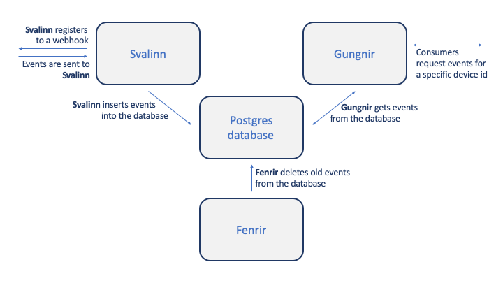

# codex

Codex provides a historical context about devices connected to [XMiDT](https://github.com/Comcast/xmidt).

## Summary

Codex accepts incoming events, stores them in a postgres database, and 
provides event information by device id.  This repo is a library of packages 
used to implement codex.

## The Pieces

* **Database:** Any postgres database will work.  In `deploy/`, cockroachdb is 
  used.  The services connect to the database using the [codex-db](https://github.com/xmidt-org/codex-db) 
  library.
* **[Svalinn](https://github.com/xmidt-org/svalinn):** Registers to an 
  endpoint to receive events (Optional).  Has an endpoint that receives events
  as [WRP Messages](https://github.com/xmidt-org/wrp-c/wiki/Web-Routing-Protocol),
  parses them, and inserts them into the database.
* **[Gungnir](https://github.com/xmidt-org/gungnir):** Has endpoints that 
  provide device information from the database.
* **[Fenrir](https://github.com/xmidt-org/fenrir):** Deletes old records 
  from the database at an interval.
* **[Heimdall](github.com/xmidt-org/heimdall):** Heimdall provides metrics to determine how accurate Codex is at determining if a device is connected to XMiDT.

## Install
This repo is a library of packages used for the codex project.  There is no 
installation.  To install each service, go to their respective READMEs.

## Deploy
for deploying the project in Docker, refer to the deploy [README](deploy/README.md).

## Contributing
Refer to [CONTRIBUTING.md](CONTRIBUTING.md).